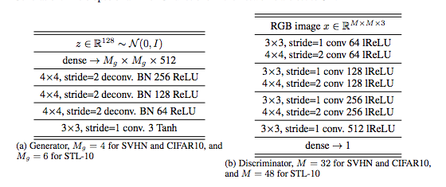
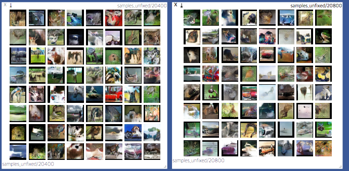
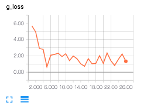
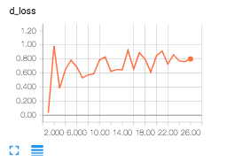
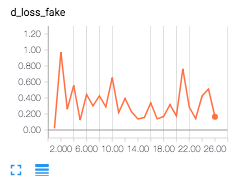
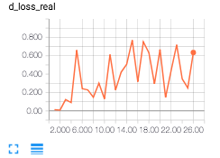

# Pytorch Implementation of SN-GAN with CIFAR10

## Requirements
nsml

## Paper
[Spectral Normalization for Generative Adversarial Networks](https://openreview.net/pdf?id=B1QRgziT-)

## Run Example
```{python}
nsml run -d cifar10_python -a "--sn"                   # Spectralnorm
nsml run -d cifar10_python                             # No SN
nsml run -d cifar10_python -a "--sn --inception_score" # Calculate Inception score
```
Of course, executing `python main.py` will do well if you make empty functions for nsml.

## Architecture

GAN Architecture is adopted from the papers' Appendix B.4 for CIFAR10
<p align="center">
  
</p>

## Results

*Generated images*
<p align="center">
  
</p>

*Loss*
<p align="center">
  
</p>
<p align="center">
  
</p>
<p align="center">
  
</p>
<p align="center">
  
</p>


